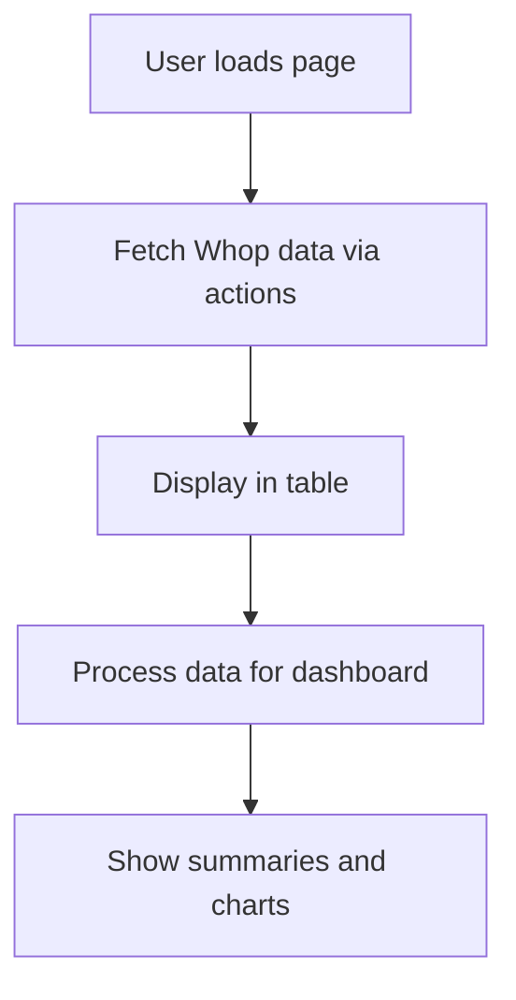

# Whop API Integration Plan

## Overview
Integrate Whop API to fetch and display data for products, payments, and users associated with the company. Create a dashboard similar to the existing test-sheet page, displaying data in a table first, then building a dashboard with summaries and charts grouped by user emails.

## API Key and Company ID
- API Key: apik_b80Jzvq84pev6_C1247731_C_7a4c24fa43e402716813e7d02039456ba8c92dc5acc0fb694485f34d349211
- Company ID: biz_gwvX72rmmUEqwj

## Steps
1. **Install Dependencies**
   - Add @whop/sdk to package.json using pnpm.

2. **Review API Documentation**
   - Access https://docs.whop.com/api-reference
   - Identify endpoints for:
     - Products: `products.list({ company_id })`
     - Payments: `payments.list({ company_id })`
     - Users: `users.retrieve(user_id)` or from payments data

3. **Implement Server Actions**
   - In `app/actions.ts`, add functions:
     - `getWhopProducts()`: Fetch all products for the company.
     - `getWhopPayments()`: Fetch all payments for the company.
     - `getWhopUsers()`: Fetch user details if needed.
   - Use the Whop SDK with the provided API key.
   - Handle pagination for large datasets.

4. **Create Dashboard Page**
   - Create `app/whop-dashboard/page.tsx` similar to `app/test-sheet/page.tsx`.
   - Features:
     - Fetch data on load.
     - Display all data in a paginated table.
     - Show raw JSON for debugging.

5. **Build Dashboard Components**
   - From the table data, create dashboard sections:
     - Summary cards: Total products, total payments, unique users.
     - Charts: Payments per user (bar chart), products sold (pie chart), etc.
     - Group data by user emails.
   - Use recharts for visualizations.

6. **Testing**
   - Test data fetching.
   - Verify table display.
   - Check dashboard calculations.

## Data Flow

## Assumptions
- Payments data includes user emails or IDs.
- Users can be fetched individually if needed.
- No authentication required beyond API key.

## Risks
- API rate limits.
- Large data volumes requiring pagination handling.
- Changes in API structure.